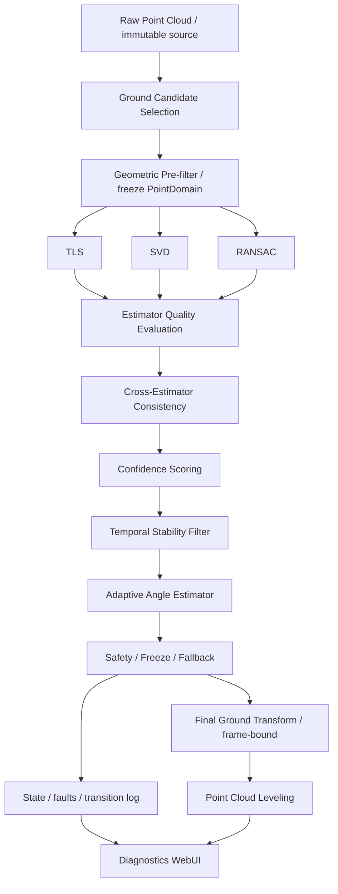
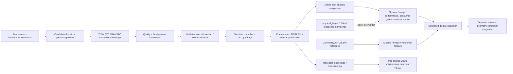

# 自适应地面配平与可信度仲裁：最终阶段正式开发计划 v1

日期：2026-10-04（Asia/Shanghai）。结论：**PLAN_READY**。本轮只制定计划、模块/接口与工单验收；九张新工单均未实施。PLAN_READY 表示可以按工单开始后续开发，不等于设备、物理精度、生产激活已放行。

名称：**Adaptive Ground Leveling Framework（AGLF）**，中文“基于多估计器一致性、可信度门控与时间稳定性的自适应地面配平框架”。TLS、SVD、RANSAC 是经典方法；自研范围是本项目的输入绑定、质量评估、仲裁、时间稳定、冻结/回退和诊断集成，不宣称原创平面估计算法。

本计划作为[现行主线 v3](GROUND_LEVELING_NEXT_STAGE_PLAN_V3.md)最后阶段的补充，与既有 GL-00～05、GL-B01/C01、GL-I0x/P02成果衔接。这里 GL-A～GL-I 是九张新工单，不等同于 v3 的 A/B/C/D 阶段简称。执行遵守[WORKFLOW v2](WORKFLOW.md)。详细字段与决策规则以[接口与状态契约 v1](ADAPTIVE_GROUND_LEVELING_CONTRACT.md)为单一设计来源；每张新工单自身只有一张版本化验收表。

## 1. 当前系统状态总结

| 项目 | 当前事实 / 层级 | 证据与边界 |
|---|---|---|
| physical installation height | **1.14 m**，用户现场测距仪实测 | 作为物理记录保留；测量datum到点云原点的精确关系尚未绑定，不用外壳尺寸构造偏移界 |
| 显示参考 | Ry(+26°)，Z translation≈+1.340m | annotator/离线preview的观测显示参考，不是已验收安装外参 |
| 四ROI输入 | A91+C102帧，392196源点；B不参与拟合 | 完整源行、session/region/frame/XYZ冻结，四区2cm内缩、全高度；原始点等权 |
| TLS/SVD | pitch26.623261°、roll−1.394671°、observed tz1.321900834m | 同域最小二乘两种实现，整体RMS1.892cm/P953.792cm；不是两份独立物理证据 |
| RANSAC raw | 26.649914°、−2.135552°、tz1.322681966m | 与TLS最大normal差.74136°、offset差.781mm；有界经典鲁棒对照 |
| 四区共同fit | 三方法逐区残差都过已有工程门 | 作者自验，未指定独审；不是未见验证集 |
| 留一区诊断 | #1/#3/#4 FAIL，#2 PASS | 必须保留；禁止靠联合平均、confidence或时间滤波把FAIL抹掉 |
| 时间能力 | 有旧GroundMonitor健康/失效逻辑；**没有本计划的自适应仲裁状态机** | 新模块复用数值原语，不宣称状态机已经实现，也不得自动解除旧recalibration latch |
| 展示 | TLS/SVD/RANSAC同帧、同域、同尺度三列HTML已有 | 当前是预计算结果展示；confidence/consensus/state/FINAL尚未实现；实际browser工具file协议受限，不能把Node检查称浏览器实测 |
| 实时/生产 | 尚未接自适应模块；P1-01仍NO | 不由本次计划自动放行shadow/接管/正式外参 |

来源：[P02 v2](P02_ACCEPTANCE.md)、[四区报告](evidence/2026-10-04_p02_four_roi_r1/08_REPORT.md)、[原始结果](evidence/2026-10-04_p02_four_roi_r1/03_RESULTS.json)、[测量与坐标审查](evidence/2026-10-04_p02_bias_review_r1/01_REVIEW_AND_DECISION.md)。旧v3/GL-N01中的1.1m是历史名义参考，不能拿来覆盖新的1.14m。SDK内部距离偏置机制仍UNKNOWN；本计划不做dist−0.10、SDK或driver修正。

## 2. 新系统架构



三估计器使用同一份不可变PointDomain，计算任务并列；并行执行的调度与截止时间属于GL-H。先验证同输入确定性，再在目标机测并行是否有收益，不宣称三线程天然快3倍。NumPy/stdlib首版，不新增PCL/OpenCV/RKNN依赖。

自适应分支是新增、显式版本化能力。旧静态配平继续保持；Raw Point Cloud与原话题不被覆盖。candidate → validation → temporal filter → accepted transform四层分开，quality通过不等于physical_verified。

## 3. 模块职责与复用边界

以下是后续实现位置规划，本轮不创建源码。

| 规划模块 | 职责 | 明确不负责 |
|---|---|---|
| `core/adaptive_ground/contracts.py` | typed records、schema/units/IDs/深拷贝/配置校验 | ROS、clock、文件写入 |
| `selection.py` | 地面候选、来源/ROI/member绑定、公共几何预筛、退化前检查 | 通过待受验残差挑验证点；自动选择最漂亮的地面 |
| `estimators/tls.py`、`estimators/svd.py`、`estimators/ransac.py` | 三个分文件薄适配器，统一输入输出，复用既有经典数值原语 | 把三算法及仲裁/状态机堆一个文件；physical flags |
| `quality.py` | full-domain与逐区质量、support、coverage、谱退化、单法score | 把score当物理正确概率 |
| `consensus.py` | signed-normal规范、pairwise图、相关性保护、GOOD/DEGRADED/BAD | 三方法结果直接平均/多数强行放行 |
| `temporal.py` | median/EMA/速率限幅、窗口/epoch/cohort管理 | 捕获异常输入后悄悄填零/沿用坏历史 |
| `controller.py` | 六状态机、更新/保持决定、age/冻结/恢复/事件 | 全算法堆一个函数；改旧标定latch |
| `transform.py` | pitch/roll→properR、观测tz与应用/逆变换、版本 | 从normal求yaw；修改1.14m |
| `diagnostics.py` | 因果日志、指标聚合、replay证据导出 | 用总体均值覆盖最差区域 |
| offline runner / ROS adapter / WebUI adapter | 调度、读取/展示/显式集成 | 把纯core引入ROS；未获准接管生产 |

复用`calibration.py`的properR/应用/逆变换、`capture_input.py`来源和源行约束、`ground_diagnostics.py`全残差/退化计算、`joint_leveling.py`Rx@Ry数值约定。受审`ground.py`的旧默认/资格语义与config冻结；适配器调用与新结果kind隔离，不能把研究结果塞进旧valid artifact。

## 4. 数据结构与角度契约

详见[契约§2–4](ADAPTIVE_GROUND_LEVELING_CONTRACT.md)。关键记录：PointDomain、PlaneEstimate、QualityReport、ConsensusReport、GroundLevelingDecision、FinalTransform、StateTransitionEvent。

PlaneEstimate统一包含n_S/d_S、source frame/单位/point_domain_id、pitch/roll、RMS/P95/support/point_count、逐区质量/coverage/eigenvalue ratio、confidence、valid与reject_reasons。invalid可携带diagnostic候选，但不能携带可应用伪valid输出。

`p_G=R p_S+t`，单位n_S与d_S表示`n_S·p_S+d_S=0`。R=Rx(roll)@Ry(pitch)，pitch=atan2(−nx,nz)、roll=asin(ny)，yaw=0作为gauge，tx=ty=0。R第三行=n_S，必须正向验证Rn_S≈[0,0,1]、detR=+1、groundZ=signed residual。禁止d/nz与refit-RMS外参优化。

**physical_height_m=1.14是独立只读测量；observed_tz_m来自观测plane，不是它的替代值。** 本框架自动适应的是观测地面角度与有门控的观测平移；没有外部heading证据不估yaw，不把局部平面/坡面标成完整world pose。

自动适应角度不等于无先验自动识别任意地面。初始化在max_pitch/max_roll的有界source角域估计，不受旧名义26°±15°fitter门暗中限制；但需要可验证ground hints/source选择域。当前四区矩形不能无记录迁移到新安装，重定选择域必须新epoch。现有区域不足时保守拒绝，不自动换ROI找漂亮平面。

## 5. 状态机

| 当前状态 | 触发 | 下一状态 / 行为 |
|---|---|---|
| INIT | first compatible input | ACQUIRING；无last_good时不伪造identity，只能单独显示明确reference seed |
| ACQUIRING | 连续N_acquire GOOD、distinct frames、稳定cohort及最短时长满足 | STABLE；一次原子提交初始accepted显示模型 |
| ACQUIRING | bad/缺帧/版本变更/不一致 | 清pending连续数；保持ACQUIRING或INIT，无错误输出 |
| STABLE | GOOD且validated/速率/age/应用门均满足 | STABLE；median→EMA→rate limit后提交；版本随接受更新 |
| STABLE | 有可信但降级的共识 | DEGRADED；默认只保持；经F验证且启用时才允许受限慢更新 |
| STABLE/DEGRADED | BAD、低confidence、几何退化、超大跳变、时间无效、断流 | HOLD；R/t及accept_revision逐位保持，不接受异常估计 |
| DEGRADED | GOOD恢复且连续恢复窗口满足 | RECOVERING→STABLE；不靠单帧复位 |
| HOLD | 第一帧可信候选 | RECOVERING；清旧pending，计数1但不提交 |
| RECOVERING | N_recover连续GOOD、cohort稳定、min_duration满足 | STABLE；限幅地回到新稳定目标 |
| RECOVERING | 任一bad/重复/间断/epoch冲突 | HOLD；pending清零，last_good不被污染 |
| 任意 | incompatible source/ROI/config/schema epoch | INIT；旧几何资格失效，显示reference另列，不借旧last_good跨版本 |

manual freeze是独立锁存位：可显示state=HOLD、reason=GL_MANUAL_FREEZE；无自动清锁。人工disable回当前明确参考/旧冻结配平模式，不自动回identity。

`last_good_transform`定义为最近一次通过全部接受门且实际应用的显示模型，保证进入HOLD时保持当前画面而非退回更旧姿态。HOLD中numeric可冻结，但fresh/eligible_for_geometry随age过期；冻结显示不等于下游跌倒/背景/控制可以继续相信过期坐标。旧GroundMonitor的recalibration_latched只有既有显式合法重新标定流程可清，新状态机不能清它。

## 6. Confidence设计

score范围[0,1]，`score_kind=heuristic_quality_v1`，是工程质量指数，不是已校准正确概率。先hard gates，后soft scores，再consensus/时间门，最后应用资格；confidence不能覆盖任何hard failure。

hard gates至少包括：输入/单位/normal/d/frame/domain一致，点数、最少受支持ROI、空间覆盖、非共线/非窄带、合理normal/observed offset域、full-domain和最差必需区域的残差/support。多个平面具有接近支持且语义不能判地面时GL_GROUND_IDENTITY_AMBIGUOUS，不取最大点数强行更新。

单估计器几何score综合q_rms、q_p95、q_support、q_count、q_coverage、q_condition、q_normal，候选权重[.15,.20,.15,.10,.15,.15,.10]，权重和必须为1。coverage、谱退化、normal等还设hard下限，避免RMS低的线状点骗高分。上一稳定姿态差/时间稳定生成q_temporal；初始化没有上一姿态时使用pending cohort内部稳定度，并显式prior_available=false。

最终score=min(有效支持成员score)×consensus_factor×q_temporal；GOOD因子1，DEGRADED≤.7，BAD0（均为候选配置，待F校核）。TLS/SVD只占LS一家，不能通过重复计权提高分数。所有分项、权重、raw/capped score、hard failure与qualification输出可审计。

## 7. Consensus规则

统一法向：按有来源的sign anchor规范n,d；若n翻转则d也翻转。无符号依据、法向近零或方向歧义先判invalid。所有可比结果必须同source_frame/units/point_domain/weights/config/frame key。normal角=acos(clamp(dot(n1,n2),−1,1))，另记录Δd、Δpitch、Δroll；同一坐标系同符号才可比较。

| 状态 | 条件 | 可以做什么 |
|---|---|---|
| CONSENSUS_GOOD | 三者valid、TLS/SVD数值一致、全部pairwise满足GOOD角/offset门，必需逐区质量过门 | 提供candidate；仍需时间/物理范围/资格门，不能直接应用 |
| CONSENSUS_DEGRADED | 最大一致簇size≥2但不满足GOOD，或一个估计器不可用；降低score | 输出2/3支持关系。含RANSAC和一个LS时有跨家族支持；已有STABLE后，F证明收益并启用才可慢更新 |
| CONSENSUS_BAD | 无size≥2的一致簇、非传递链无唯一簇、domain错配，或必需几何门失败 | 不更新；HOLD或初始继续ACQUIRING |

**TLS≈SVD而RANSAC异常是DEGRADED，不是假装两票击败鲁棒证据。** LS-only默认不bootstrap、不更新，只保留last_good；没有last_good不输出accepted transform。RANSAC≈TLS而SVD无效可作跨家族DEGRADED候选，但不得忽略SVD数值故障日志。三结果相似关系非传递时，不沿“A≈B、B≈C”把A/C强行合并。

默认选定参数，而非平均三个平面：GOOD优先TLS（SVD作数值核对，RANSAC作鲁棒对照）；跨家族DEGRADED优先更高有效quality的成员，固定tie-break。LS-only不选accepted。RANSAC内部鲁棒支持可不同，但公共输入点域相同；支持mask只作诊断，不给另两估计器偷偷换输入。

候选good_angle=.5°/degraded_angle=1.5°会把当前四区pooled .74136°判为DEGRADED；这与旧P02的2°工程一致性PASS不冲突。不得为了让当前数据绿而改门；F以预登记指标、独立数据定最终配置并版本化。

## 8. Temporal filtering与机械变化

| 方案 | 首版判断 |
|---|---|
| EMA | 简单、成本低，但异常会污染历史；只喂validated coherent candidates |
| sliding median | 对孤立尖峰可解释，但有延迟；首版采用 |
| trimmed mean | 需要解释裁剪规则，避免掩盖异常；保留为后续对照，不首版默认 |
| Kalman | 需状态/噪声模型及可观察性证据；不首版引入，只有F证明比median+EMA有收益才另单 |

raw候选→质量/共识验证→同cohort sliding median→EMA→向量/逐轴rate limiter→复查accepted固定平面质量→原子接受。窗口只含本source/ROI/config/reference epoch的distinct有效帧。bad、断流和恢复重置pending，不更新EMA到异常值。

offset独立保持physical_height记录，首版`offset_policy=gated_observed`：observed d与角度共同门控/平滑/速率限制，最终normal来自R第三行，t_z来自被接受的observed d，再检查组合的signed residual。不能只平滑角度、让tz从异常帧直接跳。`frozen_observed`作为对照profile，固定上一合格d，但角/offset不一致时仍拒绝。

max_pitch/max_roll限制绝对搜索域；max_delta_pitch/roll_per_frame与max_angle_step限制accepted变化；max_angle_rate_deg_s按实际有效dt而非“10FPS”猜测。两轴各自限幅之外限制组合角步长，避免对角线超速。5°–20° raw异常不靠EMA缓慢吞下，GL_ANGLE_JUMP→HOLD。

≤2°小幅、持续、跨家族/多ROI支持且身份一致的新姿态可进入pending_rebase；连续恢复窗口确认后限速追踪，而不是因每次相对旧姿态都较大永久无法恢复。大跳变或超过可验证范围需显式重新初始化，不自动改物理安装记录。

时间使用已验证的同流递增device相对stamp；计算dt不要求跨设备绝对同步，但禁止混用不同time_domain。dt≤0、重复帧、过大gap、乱序、无新输入tick均处理；没有dt不猜1/10。A/B/C之间真实间隔不得删除以伪造恢复时长；拼接virtual-time实验单独标synthetic/WHAT_IF。

## 9. WebUI最终设计

保留TLS/SVD/RANSAC三列，同一frame_key/PointDomain/ROI/source点/坐标范围。每列显示normal、source pitch/roll/d、全点/逐区RMS/P95/support/count/coverage/condition、quality score、valid/rejected及理由。TLS/SVD关联说明常驻。

下方新增CONSENSUS→TEMPORAL FILTER→FINAL卡：三pairwise normal/offset/pitch/roll差、支持簇/家族、raw/filtered/accepted pitch/roll/observed tz、final score、state、update_allowed/applied、last_good age、freeze开关、physical height=1.14。样例数字必须标“示例”，没有真实结果显示NOT_RUN/unknown而非填.93。

绿色STABLE/GOOD、黄色DEGRADED/RECOVERING、红色HOLD/BAD，同时文字/图标，不依赖颜色。INIT/ACQUIRING无FINAL时显示“尚未接受地面模型”，reference模式与accepted分开。FINAL的数据/版本必须与当前画面同帧，不能混合旧TLS和新RANSAC。保留四区leave-one-out FAIL与参与fit残差的区别。

事件面板可按reason筛选/导出，原有手动annotator方式保留。GL-G先独立离线/预览页面，正式生产WebUI另有GL-I授权和版本审查，当前不替换。

## 10. 日志、fault与参数管理

每次状态、accepted transform、freeze/disable、source/config/ROI epoch变化记录结构化事件：timestamp/time_domain、frame/seq/session、old_state/new_state、reason_codes、source/selector/config/transform ID、原始候选/过滤/接受值、score分项、是否applied、age。no-input事件frame=null、附last frame与本地monotonic tick，不造伪帧。

故障码包括GL_OK、GL_LOW_POINT_COUNT、GL_LOW_SPATIAL_COVERAGE、GL_DEGENERATE_GEOMETRY、GL_NORMAL_INVALID、GL_QUALITY_NOT_EVALUATED、GL_TLS_INVALID、GL_SVD_INVALID、GL_RANSAC_INVALID、GL_NO_CONSENSUS、GL_NUMERICAL_DISAGREEMENT、GL_GROUND_IDENTITY_AMBIGUOUS、GL_POINT_DOMAIN_MISMATCH、GL_ANGLE_JUMP、GL_OFFSET_JUMP、GL_RATE_LIMIT、GL_TIME_INVALID、GL_DUPLICATE_FRAME、GL_FRAME_GAP、GL_HOLD_LAST_GOOD、GL_TRANSFORM_STALE、GL_RECOVERING、GL_MANUAL_FREEZE、GL_CONFIG_CHANGED、GL_RESOURCE_LIMIT。保留全原因列表与确定优先级；GL_RATE_LIMIT区分LIMITED_STEP和REJECTED，不能只写failed。

以下仅是**设计文档中的初始候选profile**，本轮不写入任何运行YAML。最终由F/H的真实数据与预算冻结，不直接宣称最优：

```yaml
ground_leveling:
  schema_version: 1
  profile_status: DRAFT
  application: offline_only
  physical_height_m: 1.14 # 独立测量，只读；不作为observed d的拟合目标
  physical_verified: false
  runtime_enabled: false
  selection:
    roi_source: versioned_four_roi_manifest
    point_weighting: equal_per_point
    frame_point_cap: null # 离线首版无cap；H若需cap先冻结共同域与新profile
    min_supported_regions: 3
    region_min_points: 20
  quality:
    min_points: 500
    inlier_threshold_m: 0.05
    min_inlier_ratio: 0.80
    max_rms_m: 0.03
    max_p95_m: 0.05
    min_lambda2_lambda3: 0.02
    min_occupied_cells: 6
    coverage_cell_m: 0.20
    score_weights: [0.15, 0.20, 0.15, 0.10, 0.15, 0.15, 0.10]
  consensus:
    good_angle_deg: 0.5
    degraded_angle_deg: 1.5
    good_offset_m: 0.02
    degraded_offset_m: 0.05
    tls_svd_numeric_angle_deg: 0.001
    tls_svd_numeric_offset_m: 0.00001
    degraded_confidence_cap: 0.70
    min_good_confidence: 0.80
    min_degraded_confidence: 0.55
    degraded_updates_enabled: false # F证据后方可启用跨家族慢更新
    ls_only_updates_enabled: false
  temporal:
    window_size: 5
    ema_alpha: 0.15
    degraded_ema_alpha: 0.05
    acquire_frames: 10
    recover_frames: 10
    min_cohort_duration_s: 0.8
    max_pitch_deg: 60.0
    max_roll_deg: 30.0
    max_delta_pitch_per_frame: 0.25
    max_delta_roll_per_frame: 0.25
    max_angle_step_deg: 0.25
    max_delta_angle_per_second: 1.0
    max_angle_rate_deg_s: 1.0 # alias必须与上项一致，否则拒配置
    raw_jump_reject_deg: 5.0
    pending_rebase_max_deg: 2.0
    offset_policy: gated_observed
    max_offset_step_m: 0.01
    max_offset_rate_m_s: 0.02
    raw_offset_jump_reject_m: 0.05
    max_frame_gap_s: 0.30
    max_hold_age_s: 2.0
  performance:
    pending_frames: 1
    inflight_batches: 1
    estimator_workers: 3
    frame_budget_ms: null # H目标机测定后批准；null禁止实时激活
```

GL-A严格拒绝unknown keys、bool冒充数值、NaN/inf、非法单位、window非奇正整数、alpha非(0,1]、不一致alias、good>degraded、无版本ROI/权重等。启动与reload共用校验；坏reload原子拒绝，不能部分应用。score normalization软参考、coverage子门、offset数值域、source/timestamp的版本化定义见契约，最终profile所有值集中保存SHA/版本/依据。

## 11. GL-A～GL-I工单与依赖

| 工单 | 交付 | 前置 / 当前状态 |
|---|---|---|
| [GL-A](tickets/GL-A_adaptive_estimator_interface.md) | schema/输入绑定/三薄适配器/确定性 | 本计划；PLANNED，NOT_RUN，等待后续启动 |
| [GL-B](tickets/GL-B_adaptive_quality.md) | 全点/逐区质量、coverage/退化、quality scores | A软件验收；NOT_RUN |
| [GL-C](tickets/GL-C_adaptive_consensus.md) | signed pairwise/相关性/GOOD-DEGRADED-BAD | A/B验收；NOT_RUN |
| [GL-D](tickets/GL-D_adaptive_temporal.md) | median/EMA/rate、六状态、age/事件、冻结恢复 | C验收；NOT_RUN |
| [GL-E](tickets/GL-E_adaptive_offline_leveling.md) | source finalR/t与只读离线应用 | D验收；NOT_RUN，不接实时 |
| [GL-F](tickets/GL-F_adaptive_replay_validation.md) | 场景矩阵、参数比较、锁定profile/独立验证/false updates | E验收和数据inventory；NOT_RUN，缺失真数据明确分层 |
| [GL-G](tickets/GL-G_adaptive_diagnostics_webui.md) | 三列、confidence/consensus/state/FINAL、日志预览 | D/E接口及F可复现schema；NOT_RUN |
| [GL-H](tickets/GL-H_adaptive_shadow_mode.md) | 目标机实时只读shadow、预算/延迟/对照 | F/G及目标环境核验、用户具体授权；WAIT_DEPENDENCY/AUTH，NOT_RUN |
| [GL-I](tickets/GL-I_adaptive_controlled_activation.md) | 人工enable/disable/freeze、同源坐标消费者/回退 | H证据、物理/范围/版本集成门与具体授权；WAIT_DEPENDENCY/AUTH，NOT_RUN |

只有算法任务并列，源码writer串行。每单开工先新baseline（包括untracked）、集中diag/操作组合矩阵，writer自验→SUBMITTED/停写→指定只读二审→按唯一验收ID收口。CLI/model/probe按WORKFLOW实时角色授权，不由计划自动启动OpenCode、创建聊天或切模型。

## 12. 每单量化验收与场景矩阵

唯一详细条目在各ticket v1表，主计划只列共同度量和计划目标，不复制第二份验收表。

| 度量 | 计算与计划目标（非当前实测完成） | 数据层级 |
|---|---|---|
| pitch_std / roll_std | 同固定安装、固定域稳定片段accepted角std；候选目标≤.10°，且报告raw/filter/基线差与延迟 | F真实开发集+独立封存；当前pooled TLS帧std不可冒充未来accepted std |
| 连续抖动 | 每个distinct accepted帧|Δpitch|/|Δroll|≤配置轴限，组合角≤min(step,rate×dt) | D合成逐帧exact，F真实 |
| ground residual | 全域及最差必需区RMS≤.03m/P95≤.05m、support≥.8；fit/独立验证分开 | B/E/F；当前leave-one-out FAIL仍FAIL |
| estimator consistency | 全三pairwise angle/d/pitch/roll，GOOD/DEGRADED配置逐边界核验；nontransitive不强行合并 | C/F |
| 故障保持 | BAD/低score/全遮挡/跳变/无输入期间applied R/t及accept_revision逐位不变 | D/F forbidden更新数=0 |
| 恢复 | ≥N_recover个distinct、连续、同epoch GOOD且≥min_duration；前N−1不得更新 | D精确计数、F原始时间报告；不是固定“1秒”承诺 |
| false update | 畸常注释帧中错误应用次数/畸常帧数，另报错误应用次数/总应用次数；分母0记NA | F已知GT/独立标注；开发exact forbidden=0；首受控profile候选目标真实已标注集observed false updates=0，统计CI/样本数同时报告，不保证总体概率0 |
| angle adaptation | 初始10°/26°/45°、roll−10/0/+10合成已知GT；小幅≤2°真实/合成有证据的持久变化仅窗口确认后限速追踪 | E/F；这些是测试角，不是实际安装测量 |
| performance | H测额外p50/p95/p99、deadline miss、queue/drop、CPU/RSS；初始预算候选P95≤min(50ms,实际帧周期/2)，新增RSS≤128MiB、pending≤1 | 目标机实测后批准；桌面不替代RK3588/Orin；不预选未经核验目标 |

| 场景 | 预期状态/动作 | 关键负例 / 证据要求 |
|---|---|---|
| 1 正常空地 | acquisition满足后STABLE；高quality | 共线/窄带/多平面也可能RMS低，不能误STABLE |
| 2 人走动 | 不追随人体；必要时DEGRADED/HOLD | 目标位置注释、accepted姿态与baseline比较，false update统计 |
| 3 箱子进ROI | RANSAC鲁棒对照、coverage/逐区/历史门；不跟箱顶 | 复用B与A/C，不能把TLS/SVD同错当多数真地面 |
| 4 少量地面 | confidence下降、DEGRADED/HOLD | N点/coverage/eigen谱边界；低RMS不放行 |
| 5 完全遮挡 | freeze last_good；age过期几何资格失效 | R/t不跳；无last_good不补identity |
| 6 遮挡恢复 | RECOVERING连续窗口→STABLE | 第1帧/第N−1帧不可恢复，bad/gap/重复重置 |
| 7 真实小机械移动 | 稳定新cohort确认后缓慢重估 | 必须有独立动作/姿态标签；当前ABC没有这类现场证据 |
| 8 5°–20°跳变 | GL_ANGLE_JUMP→HOLD，不smooth吞异常 | 一帧尖峰、持续伪平面、时间异常、错误frame/domain分别注入 |

真实与合成严格分开。ABC只直接支撑空地/箱子/移除恢复及短时稳定；没有“人在走动/全遮挡/机械移动已验证”的证据。其他现有PCAP须先只读盘点来源、单位、帧/标签，找不到记NOT_RUN/BLOCKED。独立最终数据先封存，当前已曝光ABC/89/99帧不可回标未见holdout。

false-update统计同时公开异常episode数、帧数、excluded/unknown标签数与profile适用范围。相邻点云帧高度相关，不能拿每帧当独立试验计算过窄CI；有足够独立episode时使用预登记episode/block统计，没有可辩的独立样本则CI=NOT_ESTIMATED，仅报告观察计数，不把零观察误更新解释为总体错误率零。

## 13. 风险与放行条件

| 风险 | 控制 / 解除条件 |
|---|---|
| 地面身份错误，多法共同拟合箱顶/工作台 | ground semantic/anchor、多个ROI、竞争/逐区/历史；consensus不能当物理证据 |
| 当前留一区3/4失败，单平面跨区不泛化 | 原样纳入F，不靠增加滤波或confidence转绿；必要时限定已证范围，范围变更单独版本 |
| TLS/SVD相关，2/3多数虚高 | 家族计权、LS-only不bootstrap/更新、数值故障分流 |
| 自适应ROI随当前结果漂移形成自证 | 本阶段固定source/domain版本；重安装需新selector epoch和验证，不默默追踪ROI |
| 1.14物理高度与1.322观测补偿差异 | 两字段分离，系统unknown不Gaussian/RSS，不SDK根因假定、不硬减距离 |
| EMA掩盖bad、恢复太快、last_good过期 | validated cohort、reset规则、min duration/distinct帧、age/qualified分离 |
| 安装变化与地面坡度/SDK偏置不可分 | 标成observed frame correction；缺独立gravity/物理数据不写安装真值 |
| 动态ground坐标制造目标位移/背景ghost | H不改主链；I必须版本一致、锁定/站姿采集期间冻结，相关消费者reset/reproject审查 |
| 三线程/BLAS/队列积压导致CPU爆发 | 一个batch/一pending、deadline discard、目标机对照；过载HOLD，cancel不冒称停止正在跑的NumPy |
| 日志/网页混帧或confidence误当真实概率 | frame绑定快照、score_kind与cause、qualifications/units、文字状态 |

I的物理/外推、性能、下游geometry/标定版本、人工开关与release授权门独立存在。目前全场/独立物理门未闭合，H/I不可由PLAN_READY越过。缺这些证据不阻A～G软件计划准备与后续授权内离线开发。

## 14. 回退与受控激活方案

H只订阅现有点云，发布独立shadow diagnostics/可选独立预览输出，比较current vs adaptive；不改源点云、driver、旧标定、GL02 latch或原WebUI选择链。

I默认OFF，控制命令明确为enable / disable / freeze / unfreeze / rollback。显式enable令牌绑定获审release/profile/source/ROI/适用范围；人工freeze锁存、disable立即回固定current模式，rollback切回获审固定release/profile并清pending，不自动重新enable。保留原始source话题；adaptive输出使用独立topic/frame/transform_id，不复用原frame名掩盖变换。原calibration.json与physical字段保持不可变。

第一受控激活只到显示输出。若要服务候选/跌倒/背景/跟踪，必须在I列出所有消费者与操作矩阵：startup/reload/sameID不同内容/newID/caller mutation、locked/pending/站姿采集、无输入/坏帧/失效/恢复。点云、真实点AABB、二维投影、选择、状态同frame+transform_id；旧ground缓存/基线跨reference epoch必须失效或受审重投影，不能把变换变化当人的运动。锁定/站姿采集期间首版冻结adaptive更新，不自动跨旧版本继续qualified。

数值proposal的每次接受都有新accept_revision/transform_id，重大reference rebase有新reference_epoch；旧GL-P01消息kind/schema不改，新诊断协议独立。physical/runtime资格不得靠H或confidence自动提高。enable/disable/freeze/recovery只通过已审原子控制入口，失败不半更新。

回退采用既有不可变release/配置版本和已知固定模型，关闭独立adaptive输出、清pending，不删除原始数据/历史失败。恢复后需新的稳定cohort，disable不自动清manual freeze或重新启用。所有控制操作与回退成功/失败留事件及源SHA。

## 15. 最终系统数据流与结论



**PLAN_READY**：现行最终路线、接口/参数候选、九工单依赖、逐ID验收、场景/指标、失败保留和回退已编制。GL-A～GL-I实现均NOT_RUN，本轮没有源码重构、运行配置/原PCAP/SDK/driver/正式外参/生产WebUI变更。下一可启动单是GL-A；启动实现与后续H/I现场动作由后续明确授权承接。
