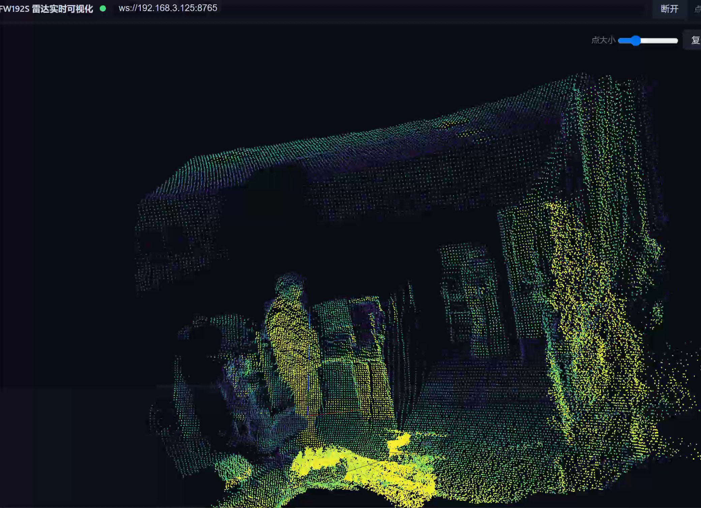

# RK3588 人体定位、人工选人与 WebUI 跌倒显示

更新：2026-10-01。状态：**首版软件已实现并独立复审；真人标定/准确性未验收**。接口见INTERACTION_CONTRACT.md，实际浏览器证据见HF07/11第1轮17_codex_browser_review.md；正式部署/性能由HF09记录。HF-00/01冻结范围保持。

## 1. 最终交付目标

用户已能通过现有 WebUI 观察人体点云，进一步确认首版采用**人工选人＋自动跟踪框**。RK3588 完成人体样候选、位置估计、目标基线采集、持续跟踪与跌倒时序判定；浏览器完成点云显示、选择确认、位置/标定交互、跟踪框叠加与跌倒状态呈现。算法结果由板端产生。

在现有点云页面中，用户进入选人模式，拖框圈住一个人体候选并确认；板端确认目标后，页面持续显示该人的三维位置、距离、编号与自动更新的框，允许采集站姿基线。跌倒判定状态和事件在同一页面显示。首版锁定一人，其他候选可见但不自动成为被锁定者。

## 2. 当前证据与源码位置

- 用户录屏：`C:\Users\30680\Videos\Captures\屏幕录制 2026-09-30 152344.mp4`，10.133 s、2080×1510、30 fps，SHA256 `a9b1ed42f6ba8c91455605492eaf53093d4622204cee3dddce71c2dfd89926b4`。抽样可辨人体轮廓和实时点云界面；录屏没有展示选人、跟踪框或跌倒结果，不作为算法验收。
- 当前 Codex 只读核对板端 `/root/catkin_ws/webui/`：index.html、three.min.js、OrbitControls.js 和已有备份。8090 提供静态页、8765 提供 Foxglove WebSocket；页面使用 Three.js/OrbitControls，原始 XYZ 直接进入场景，当前订阅 `/innolidar_points`、`/inno_imu`、`/device_status`。
- 当前源码快照：[index_device_snapshot.html](evidence/2026-09-30_webui_scope/index_device_snapshot.html)，SHA256 `758740324ad00d341015915f123f0f6576b260993e94c1f85460b9d3b59f253b`。此文件是只读证据，不是后续开发入口，也不包含用户的新指令。
- HF11已重新读取板端最新页面并保存webui/index_board_20261001.html；新增webui/human_fall_preview实现复用原Three.js/OrbitControls及许可。旧快照仅历史证据，不覆盖原活动首页。
- 对 `/foxglove_bridge/capabilities` 的参数查询返回未配置，退出码 1，见 [查询日志](evidence/2026-09-30_webui_scope/bridge_capabilities.txt)。这不能证明 bridge 不支持客户端发布。现有页面只有订阅实现；选择请求的写入能力、允许话题与回执链路必须在实现前实查。



录屏元数据、原视频哈希和抽样时刻见 [recording_metadata.json](evidence/2026-09-30_webui_scope/recording_metadata.json)。只保存本地证据，不上传录屏或原始人体点云。

## 3. 三种“标定”各自负责什么

| 功能 | 操作与输出 | 完成工单 |
|---|---|---|
| 安装/地面几何标定 | 验证传感器坐标、安装变换、地面平面与有效范围，提供可用坐标/参数版本 | HF-03 |
| 网页选人与位置确认 | 拖框/点候选，板端确认唯一目标，返回实际坐标系中的位置和 track_id | HF-05＋HF-11 |
| 目标站姿基线 | 锁定后按按钮，由板端采集一段稳定站立观测，验证质量并保存高度/范围/初始位置及标定版本 | HF-05＋HF-11 |

网页像素框只用于交互，不能当米制坐标或替代安装外参。坐标来自板端点云/已验证变换。未验证参考系时可标明“雷达坐标 innolidar”，不能显示成已标定世界坐标。位置定义为可见点云簇的稳健中心，不能暗称人体解剖质心或脚中心；若输出地面投影位置须注明定义与地面有效性。UI 需分开显示目标基线和安装/地面标定状态，按钮成功不等于物理外参全部通过。

## 4. 处理与显示链路

```text
RK3588 / ROS1：点云与辅助数据
  → 时间/质量检查 → 地面/背景 → 人体样候选与三维包围盒
  → 人工选择请求确认 → 站姿基线 → 连续跟踪 → 跌倒时序判定
  → 候选快照、目标状态、事件、选择/标定回执
             ⇅ 复用现有桥接，按实查能力接入
WebUI：实时点云＋候选框 → 人工拖框确认 → 自动跟踪框/坐标＋跌倒状态
```

浏览器把板端的三维包围盒投影到当前显示视角，也可叠加三维线框；选人模式与 OrbitControls 的旋转/缩放分开，避免拖框时改变相机。前端旋转、缩放、画布尺寸/DPR 变化后须重新投影；算法输入和地面高度仍用物理坐标。原始点云视图相机的“z 朝上”设置只是显示约定，不证明传感器已完成重力/安装标定。

拖框覆盖多个候选或前后重叠时显示候选列表/深度供人工确认，禁止只凭相近屏幕位置自动换人。目标框随有效处理帧更新；遮挡预测框需标注预测，不能作为跌倒观测。多人交叉/完全丢失后按原跟踪规则要求重新选人。

## 5. 新增接口草案与一致性要求

下列独立话题/字段是 HF-04/05/07/11 的草案，不属于已冻结的 `/human_fall/health` 或 manifest。实现前核对并由 Codex 冻结，不在 health v1 中混入控制请求或候选结构。

| 接口 | 方向 | 需要的信息 |
|---|---|---|
| `/human_fall/candidates` | RK3588 → WebUI | 版本、检测 session/time_epoch、snapshot_id、对应点云 seq＋raw sec/nsec、frame_id、标定版本、候选 id、三维中心/包围盒、点数/质量和可选状态 |
| `/human_fall/selection_request` | WebUI → RK3588 | request_id、操作（选中/解除/采集基线）、检测 session/time_epoch、snapshot_id、candidate_id 或已锁定 track_id、预期选择版本；不接受裸像素作为空间坐标 |
| `/human_fall/selection_ack` | RK3588 → WebUI | request_id、accepted/rejected、原因、板端实际 track_id/选择版本、基线 pending/ready/failed 与参数版本 |
| `/human_fall/state`、`/human_fall/event` | RK3588 → WebUI | 原状态/事件规则＋位置/包围盒、坐标/标定版本、实测/预测标志及对应源帧；精确 schema 在后续工单冻结 |

最小实现继续使用版本化 `std_msgs/String` JSON，复用现有 Foxglove 数据链路。先核对运行 bridge 的 serverInfo 能力、客户端发布路径与允许话题；若不可用，只增加确有必要的最小选择请求适配，不同时引入 ROSBridge、MQTT 或通用服务平台。输入只允许选择/标定操作，不涉及车辆运动。

页面选择请求须绑定当时看到的候选快照。板端以自己的当前 session/epoch、有限缓存、单调新鲜度与质量检查决定是否接收；陈旧快照、旧连接请求、重复/冲突请求、多候选或目标质量不足均明确拒绝/回执。不直接锁定已消失的人。重连后不能自动重发旧选择；页面先取板端当前状态。切换/解除目标重置动作历史，已发事件记录保留。

同屏点云、候选框和目标框按 raw 源帧标识关联，不靠设备 stamp 与浏览器墙钟相减判断延迟。不能把旧框叠到新场景后仍称位置有效。允许在合理短窗口显示“上一帧/等待匹配”，超过可配新鲜度时灰显/隐藏位置框并显示未知。字段缺失、未知版本、断连、标定无效或后端错误均不得默认绿色正常。

## 6. 页面要显示的内容

实时点云区显示候选框、锁定框与位置标签。操作区提供选人、确认/解除、采集站姿基线、重新标定及回执。状态区至少显示当前目标编号、XYZ/距离与坐标系、地面/目标基线有效性、跟踪状态和跌倒状态；事件区显示事件时间、编号、原因和保存记录。

跌倒状态明确区分 upright、descending、low_posture_unclassified、suspected、confirmed、recovering、unknown。confirmed 可用红色强调、suspected 用黄色、unknown/丢流用灰色，但文字必须可读；低姿态、遮挡或数据丢失不能显示成已确认跌倒。显示板端已存事件与当前姿态状态，两者不互相覆盖。UI 只显示工程检测结果，首版不自动联系第三方。

## 7. 工单调整与最终验收

软件已按HF02→03→04→05→06→07→11→08完成实现/复审，HF09部署与性能测量正在执行，HF10由当前Codex持续独立检查。以下仍是最终真人验收条件；合成选择/基线/断连实测不能替代真人动作与精度证据。

最终在真实 RK3588 和浏览器联调验证：

1. 网页拖框选对人、板端回执锁定、位置与三维包围盒随动作更新；改变视角/缩放/DPR 后框仍对准对应候选。
2. 人工采集站姿基线，稳定/质量不足分别成功或拒绝；页面标定状态与板端保存版本一致，切人不继承前人的动作历史。
3. 在有保护措施的测试中，下降/低姿态/确认跌倒及困难负例的板端状态在页面正确呈现；初始化已躺、蹲坐、遮挡、丢流明确显示相应未分类/unknown。
4. 多人遮挡/交叉不换人，旧快照点击、重复请求、断连/重连、节点重启和过期数据不假锁定或假正常；事件不重复计数。
5. 算法跑在 RK3588，浏览器只做交互/渲染；分别实测板端有效处理率、框/状态更新率、队列/丢帧、到页面的延迟与浏览器 FPS。性能门槛在 HF-09 实测后提交冻结，不把浏览器流畅或原始点云约 10 Hz 冒称算法已达实时门槛。

证据必须含板端日志、参数/源码版本、对应 bag 和网页录屏/截图。本次已有视频只支持“点云页面能看到人体轮廓”，不支持新增选人或跌倒功能已完成。

## 当前部署与独立复审（2026-10-01）

正式版本20261001T051310Z，地址http://192.168.3.125:8090/human_fall/index.html。软件211两端回归/44独立边界/18网页检查通过；真实显示流抽样12000点、算法完整原流，实际源帧框对齐与选择/解除、断连守卫已复测。原首页保留。最后失锁编号复用与密度/冻结解码器补修记录HF10。真实地面/背景/人体标签仍未验收、confirmed关闭；自动化未做拖框手势，后续真人验收条件仍有效。
